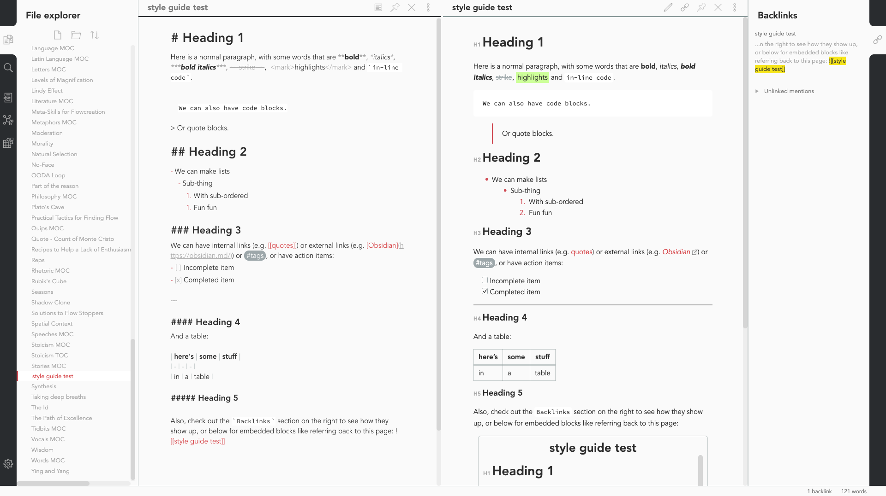
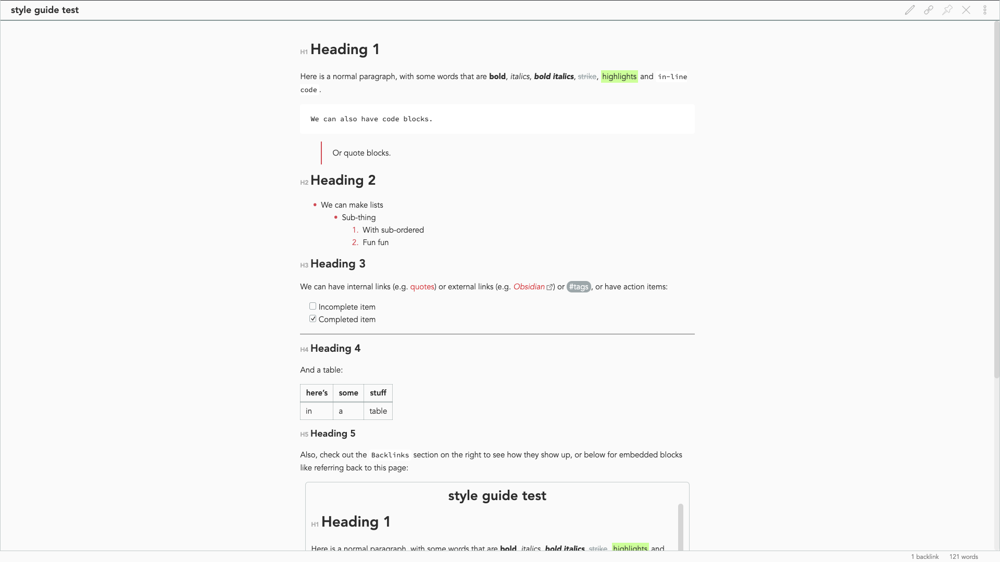
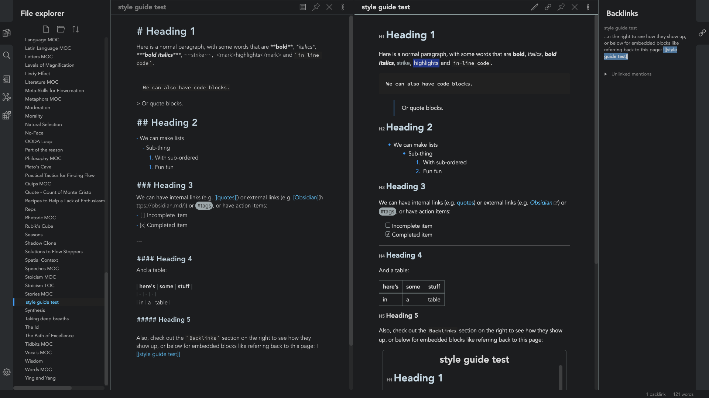
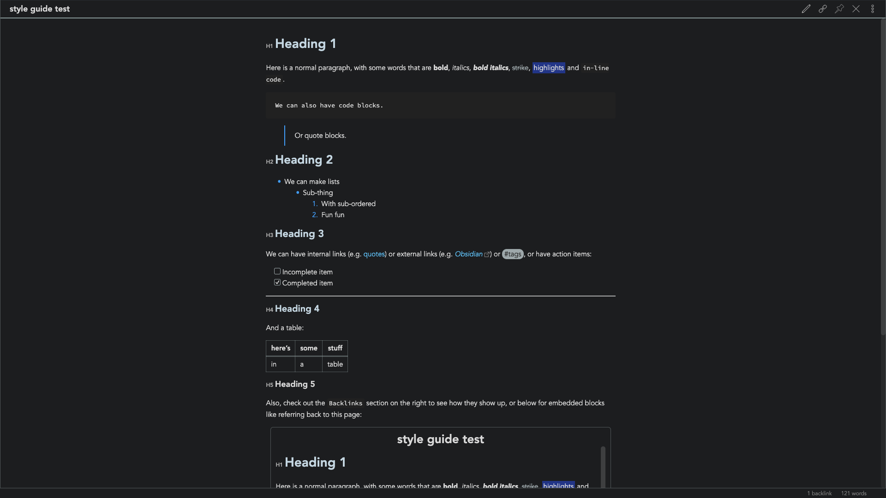

# "Ursa" Light and Dark Theme for [Obsidian.md](https://obsidian.md/)

> A light and dark theme for [Obsidian](https://obsidian.md/) featuring "zen mode" with collapsing side panels and improved single pane viewing, compatible to Obsidian V0.5

## Install

1. Download the obsidian.css file.

2. In Obsidian click Settings->Plugins and turn on "Custom CSS".

3. Put the "obsidian.css" in your vault root folder.

4. Restart Obsidian.

_The font used is Avenir, so make sure you have that downloaded in your font library to achieve the full effect_
